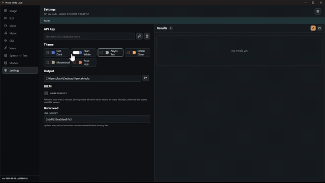

# Venice Media Local

Venice Media Local is a fan-made desktop app for the Venice community. It lets you use your own Venice API key to generate media locally, with images, video, music, sound effects, voice, and speech-to-text grouped into one workspace.

The purpose is simple: keep your API key and generated files on your machine, make heavy media sessions easier than a browser tab, and give users a privacy-minded cleanup path. Normal file deletion can leave recoverable traces for forensic tools, so this app has a burn folder workflow that best-effort overwrites/corrupts files before deleting them. On SSDs or journaled filesystems, the OS or drive may retain old blocks.

This project is independent from Venice and is not affiliated with, endorsed by, or maintained by Venice. It is built around Venice's API for people who want direct control over their own keys, generated files, and local creative workflow.

When enabled from Settings, **AI Agent Remote Control** lets trusted tools such as Codex, Claude Code, or other agents connect to Venice Media Local from the same machine or a trusted remote machine, inspect the app state, and drive media workflows on the user's behalf.

## Demo



[Watch the full MP4 demo](./docs/media/demo.mp4)

## For Humans

Use an official release build or build the app locally, paste in your own Venice API key, and generate media from your machine. The key stays on your computer in the operating system credential store. There is no shared server operated by this project.

Release safety:

Official GitHub releases may include an unsigned Windows installer and/or direct `.exe` for convenience because Windows is the maintainer's main workstation. If you download a binary, verify that it came from this repo's [Releases page](https://github.com/neko-legends/venice-media-local/releases), compare its SHA256 hash with the release notes, and optionally scan it with [VirusTotal](https://www.virustotal.com/gui/home/upload). Virus scanners are useful, but they are not proof that a binary matches the source code. If you are security-sensitive, build from source instead.

Platform note:

This is a Tauri desktop app, so it is not Windows-only. Windows, macOS, and Linux users can build it from source. This repo may only provide Windows `.exe` builds in releases because that is the machine used to package and test official binaries right now. macOS and Linux users should ask their AI coding agent, or a developer friend, to install the local prerequisites and build the app on their own machine.

Installed and portable Windows builds share the same app identity, settings, and local control API. Venice Media Local runs as a single instance, so launching the portable app while the installed app is already open brings the existing window forward instead of starting a second copy.

Plain-English release path:

1. Download the latest release from this repo's [GitHub Releases page](https://github.com/neko-legends/venice-media-local/releases).
2. Compare the downloaded file's SHA256 hash with the hash in the release notes.
3. Optionally upload the file to [VirusTotal](https://www.virustotal.com/gui/home/upload).
4. Run the installer or direct `.exe`.
5. Paste your Venice API key when the app asks for it.
6. Choose a media type from the left side, refresh models if needed, and generate media.

Plain-English source build path:

1. Install Node.js 20+ and Rust.
2. Clone this repo.
3. Run `npm install`.
4. On Windows, run `.\Build-Windows.ps1`. On macOS or Linux, use the generic Tauri build command in the build sections below.
5. Open the locally built app from `src-tauri\target\release\`, or use the platform-specific bundle Tauri produced under `src-tauri\target\release\bundle\`.
6. Paste your Venice API key when the app asks for it.
7. Choose a media type from the left side, refresh models if needed, and generate media.

The goal is simple:

- Image, video, music, sound effects, and voice in one app.
- No chat UI and no text-agent clutter.
- Results save to local files automatically. Images default to WebP to keep files smaller.
- Metadata sidecars are written next to normal generated files by default as `file.ext.json` using the Neko Media Sidecar v1 schema. Turn this off in Settings if you do not want recipe JSON beside outputs.
- Generic filenames can be enabled in Settings to avoid putting prompt/title text into filenames. Private Session implies generic filenames automatically.
- Private Session is a one-click header toggle. When it is on, outputs go under `private\`, a `.nekoignore` marker is created there, filenames are generic, and metadata sidecars are never written.
- Clear only removes result cards from the app. Trash moves generated files into the output folder's `burn` subfolder.
- The burn button best-effort corrupts and deletes files from the burn folder, bypassing the Recycle Bin. On SSDs, wear leveling/TRIM and filesystem journals can still leave old blocks outside app control.
- Burn also handles generated sidecars. If another library has already copied a generated file or recipe into its own vault, use that library's own permanent delete/shred action too; Venice Media Local only burns files inside its output folder.
- Settings shows a live burn seed that updates from time and mouse movement, then mixes into the burn overwrite pass.
- Models can be refreshed from Venice and managed locally.
- The app can expose Venice API features in one place, even when different Venice clients expose those features differently.
- The interface can be tuned for creators who generate a lot of media, instead of behaving like a general chat or social feed.

Why this can be nicer than using a hosted web UI:

- **Your API key stays local.** The app calls Venice directly from the local Tauri backend.
- **Your outputs are local files.** Generated media is saved on disk instead of being trapped in a browser session.
- **No browser storage quota wall.** Browser apps can hit local storage, IndexedDB, or cache limits when lots of media piles up. This app writes outputs to normal folders on disk, so practical storage is limited by the drive you choose.
- **Cleaner local cleanup.** Result cards can be cleared without touching files, moved to the local burn folder with trash buttons, or burned later when the user wants to corrupt and delete the files.
- **One media workspace.** Image, video, music, SFX, and voice are grouped by media type in the left rail.
- **Less browser friction.** No browser tabs, browser profile issues, extension conflicts, or accidental refreshes.
- **Better long-session potential.** Hosted web UIs can get laggy when a lot of images/results pile up. This app already saves outputs locally, and the UI can be optimized around local history, paging, folders, and cleanup.
- **Model control.** Use **Get Latest From Venice** to refresh models, then add/remove models locally for your own workflow.
- **Community modifiable.** Because this is an open local app, the community can add presets, batch tools, naming rules, galleries, export packs, prompt templates, or workflow shortcuts without waiting for the official UI.
- **Themeable.** The included themes give the app a few polished dark and light looks.
- **Locally buildable.** It can produce a normal Windows setup executable from source, with macOS/Linux builds possible through Tauri.

This is not meant to replace Venice. It is a local power-user workbench for Venice media generation.

## License

Venice Media Local is released under the MIT License. You can use, copy, modify, fork, upgrade, publish, and redistribute it, including modified versions, as long as the MIT copyright and license notice stay with the software.

## For AI Agents

If you are an AI coding agent helping a human with this repo:

1. Do not commit API keys, generated media, build output, or local app data.
2. Use the helper scripts on Windows because this machine may have a broken user-level `npm` shim.
3. Use the committed lockfiles: `package-lock.json` and `src-tauri/Cargo.lock`.
4. Build with Tauri before handing off a local installer.
5. Tell the human where the installer was produced.
6. For release builds, commit first, then run the Windows build script so the generated version includes the release commit hash.
7. Preserve the output cleanup behavior: clear only clears UI results, trash moves files to `<output folder>\burn`, and burn corrupts/deletes files from that burn folder.
8. For public binary releases, include SHA256 hashes in the release notes and consider adding a VirusTotal scan link.

Agent install/build handoff:

1. If a human wants convenience, point them to this repo's official GitHub Releases page, not random third-party `.exe` mirrors.
2. If building locally on Windows, run `.\Build-Windows.ps1` from the repo root.
3. If building locally on macOS or Linux, install the normal Tauri prerequisites for that OS, then run `npm run version:build` and `npm run tauri -- build --config src-tauri/tauri.version.conf.json`.
4. After a successful Windows build, the installer is in `release\installer\` and the portable executable is in `release\portable\`.
5. Tauri's raw bundle outputs are also left in `src-tauri\target\release\bundle\nsis\`.
6. Do not commit `dist/`, `src-tauri/target/`, `node_modules/`, `.env*`, or generated media.
7. If preparing release notes, include the build version, commit hash, SHA256 hashes, and a VirusTotal link if available.

The Venice API key is stored through the OS credential store at runtime. It is not written into the repo. `VENICE_API_KEY` is supported as a developer fallback, but `.env*` files are ignored and must not be committed.

Credential store service/account:

```text
venice-media-local / venice-api-key
```

### Theater Mode Remote Control

Venice Media Local can expose a local HTTP control API for trusted agents on the same Tailscale network. The human enables **AI Agent Remote Control** in Settings. That choice is saved: if it was enabled when the app closed, the app restores the control server on its next launch. Turning it off in Settings stops the server and keeps it off on later launches.

Agents should start by reading the discovery file on the Windows machine:

```text
%APPDATA%\community.venice.media.local\control-api.json
```

That file includes non-secret `address`, `port`, app `version`, bind address, credential fingerprint, `manifestUrl`, `healthUrl`, and `schemaVersions` fields. The bearer credential is held in the operating-system credential store and is never written to discovery or returned by `/api/v1/state`. By default the server binds to the Tailscale IPv4 address when available, otherwise `127.0.0.1`. Most users should leave **Bind all interfaces** off; turn it on only when a trusted agent cannot connect through the normal Tailscale or localhost address, such as LAN, VM, Docker, WSL, or unusual remote-agent setups. Binding `0.0.0.0` is an explicit Settings opt-in with a warning because every reachable network adapter can accept Agent Control connections. Use the locally provisioned credential as a Bearer token:

```bash
curl -H "Authorization: Bearer <token>" http://<address>/api/v1/state
```

(The discovery file contains the exact address and a non-secret credential fingerprint. It does not contain credential material.)

The default control port is `9876`, and Settings lets you change it. If the connection times out, check Tailscale Access Controls. Add a rule where the remote agent machine is the source, the Windows machine running Venice Media Local is the destination, and the port/protocol matches the discovery file:

```text
tcp:<port>
```

In plain English: allow the remote agent source to control this local Windows destination on the configured TCP port.

Useful Theater Mode endpoints:

```text
GET  /api/v1/state
GET  /api/v1/capabilities
GET  /api/v1/health
POST /api/v1/navigate
POST /api/v1/generate-image
POST /api/v1/edit-image
POST /api/v1/remove-background
POST /api/v1/upscale-image
POST /api/v1/queue-video
POST /api/v1/retrieve-video
POST /api/v1/queue-music
POST /api/v1/queue-sfx
POST /api/v1/retrieve-audio
POST /api/v1/generate-speech
POST /api/v1/transcribe-audio
POST /api/v1/refresh-models
POST /api/v1/open-output-folder
POST /api/v1/open-burn-folder
POST /api/v1/clear-results
POST /api/v1/move-to-burn
GET  /api/v1/burn-folder-stats
POST /api/v1/burn-folder
```

The endpoints above are revision-1 compatibility routes and retain their existing response shapes, including `dataUrl`. Phase 5 automation should use the revision-2 provider contract:

```text
POST   /api/v1/operations
GET    /api/v1/operations/:providerOperationId
GET    /api/v1/operations/:providerOperationId/events
POST   /api/v1/operations/:providerOperationId/cancel
POST   /api/v1/operations/:providerOperationId/transfer-grants
POST   /api/v1/operations/:providerOperationId/execute
POST   /api/v1/artifact-uploads
PUT    /api/v1/artifact-uploads/:uploadId/content
POST   /api/v1/artifact-uploads/:uploadId/complete
DELETE /api/v1/artifact-uploads/:uploadId
GET    /api/v1/artifacts/:providerArtifactId
GET    /api/v1/artifacts/:providerArtifactId/content
```

Revision 2 is descriptor-first: it stores durable operation/event evidence, streams sealed inputs and artifact downloads, bounds upstream output buffering, and does not persist inline media. Callback credentials are encrypted with a key protected by the OS credential store. If protected storage is unavailable or an existing ledger key is missing, operation admission fails closed and never replaces the key.

Every transfer requires `X-Transfer-Grant-ID` plus `X-Transfer-Grant`. Grants are durable, consumable, and exact-bound to the operation, attempt, assignment revision, capability, HTTP method/path/scope, artifact or upload identity, SHA-256, byte size, MIME type, validity interval, and maximum uses. Core first admits the operation with exact expected input artifacts, then registers grants through the operation-bound route, creates/writes/seals those uploads, and finally calls `execute`. Text-to-video declares no input artifact; image-to-video declares and seals its first-frame artifact before execution.

Provider lifecycle credentials are separate from the invocation token and Venice API key. The protected local `configure_provider_lifecycle` command stores the scoped credential only in the OS credential store; lifecycle credentials are never imported from environment variables. Non-secret Core origin/credential metadata is written atomically. When configured, the provider self-registers, persists each exact heartbeat body/sequence/digest before delivery, replays ambiguous heartbeats unchanged, and unregisters on Agent Control shutdown or application exit. Discovery-file/manual handoff remains available while lifecycle configuration is absent or degraded.

Queued work can be canceled only during `pre_submission` while `submission_not_started`; cancellation after Venice submission truthfully reports `unsupported`.

Remote media actions update the already-open Windows GUI live. Navigation, queues, generated results, result clearing, and burn-folder moves should appear in the app as if the human had clicked through the workflow.

Two pitfalls discovered in live use:

**Prefer camelCase in agent JSON.** The HTTP control API mirrors the GUI request structs, so fields like `aspectRatio`, `negativePrompt`, `safeMode`, `sourceImage`, and `queueId` are the canonical spelling. Snake_case aliases are accepted for compatibility, but older builds ignored optional snake_case fields such as `aspect_ratio`, which could silently produce the wrong image shape.

**Legacy only: cache the dataUrl after every generate call.** The revision-1 generate response includes a base64 `dataUrl` field for each output image, and the legacy edit endpoint requires it. Revision-2 operations use sealed artifact uploads instead and never require command-line base64.

**Legacy only: send edit payloads via a file, not via shell arguments.** Revision-1 edit bodies can contain a large data URL. Revision 2 streams exact bytes through the upload routes and forbids embedded media in operation JSON.

#### Agent skill for Hermes

If you are a Hermes agent (or use a compatible skill loader), install the bundled skill:

```text
agent-skills/venice-local-gui/
```

Copy that folder into `~/.hermes/skills/` and your agent will know the full API, request shapes, pitfalls, and generate→edit→upscale workflow. The `references/` subfolder includes:

- `implementation-notes.md` — Rust wiring, event emission, design decisions
- `remote-access-troubleshooting.md` — Tailscale ACL, firewall, discovery file edge cases
- `venice-local-gui-request-types.md` — exact Rust structs and proven request examples

## Prerequisites

- Node.js 20+.
- Rust/Cargo stable.
- Windows WebView2 runtime for Windows users.
- macOS or Linux system packages required by Tauri when building on those platforms.
- Network access for first dependency install and first Tauri bundler download.

On this Windows workstation, known-good paths are:

```text
C:\Program Files\nodejs\npm.cmd
C:\Users\flash\.cargo\bin\cargo.exe
```

## Install Dependencies

Fresh clone:

```powershell
npm install
```

If `npm` resolves to a broken user shim on Windows, use:

```powershell
& "C:\Program Files\nodejs\npm.cmd" install
```

## Run In Dev

```powershell
.\Start-Dev.ps1
```

Generic command:

```powershell
npm run tauri -- dev
```

## Build Windows Installer

```powershell
.\Build-Windows.ps1
```

Generic command:

```powershell
npm run version:build
npm run tauri -- build --config src-tauri/tauri.version.conf.json
```

The helper script generates a temporary Tauri config at:

```text
src-tauri\tauri.version.conf.json
```

That file is ignored by git. It gives the installer a build-time version shaped like:

```text
2026.5.9221530+gabcdef12
```

Meaning:

- `2026` = year
- `5` = month
- `9221530` = day + time, here day 9 at 22:15:30
- `gabcdef12` = git commit hash

If the project has not been committed in its own repo yet, the hash part becomes `gnogit`. Commit first for real public release installers.

Keeping the app identifier stable and increasing this version on each build lets the Windows setup executable install over/upgrade an existing install instead of looking like the same old build.

Note: Windows file metadata requires numeric version pieces, so Windows may strip the commit hash from the low-level `VIProductVersion`. The setup filename and generated Tauri version still include the hash metadata.

Current release output:

```text
release\installer\Venice Media Local_<build-version>_x64-setup.exe
release\portable\venice-media-local.exe
```

Tauri's raw bundle outputs are also produced at:

```text
src-tauri\target\release\bundle\nsis\Venice Media Local_<build-version>_x64-setup.exe
src-tauri\target\release\bundle\nsis\Venice Media Local_<build-version>_x64-portable.exe
src-tauri\target\release\venice-media-local.exe
```

## Build Verification

Run these before handing off:

```powershell
npm run build
cd src-tauri
cargo check
cd ..
npm run version:build
npm run tauri -- build --config src-tauri/tauri.version.conf.json
```

On this workstation, use the helper scripts or set PATH first:

```powershell
$env:Path = "$env:USERPROFILE\.cargo\bin;$env:Path"
& "C:\Program Files\nodejs\npm.cmd" run tauri -- build
```

## Public Repo Hygiene

Expected source files to commit include:

- `src/`
- `src-tauri/src/`
- `src-tauri/capabilities/`
- `src-tauri/icons/icon.ico`
- `package.json`
- `package-lock.json`
- `src-tauri/Cargo.toml`
- `src-tauri/Cargo.lock`
- `src-tauri/tauri.conf.json`
- helper scripts and docs

Ignored/generated files include:

- `node_modules/`
- `dist/`
- `src-tauri/target/`
- `src-tauri/gen/`
- `.env*`
- `outputs/`, `generated/`, `media/`
- logs and temp files

## Current media surface

- Image generation saves local image files and displays result cards.
- Edit tools support prompt-based image edit/combine, background removal, and 2x/4x image upscaling.
- Video, music, and SFX queue jobs through Venice and include polling hooks.
- Voice generation calls Venice speech and saves local audio files.
- Output cleanup supports clearing UI cards, moving generated files to the local `burn` folder, and burning that folder.
- Model refresh calls Venice model catalog endpoints and caches normalized model lists locally.
- Model manager supports local add/remove overrides.
- Includes multiple dark and light color themes.
